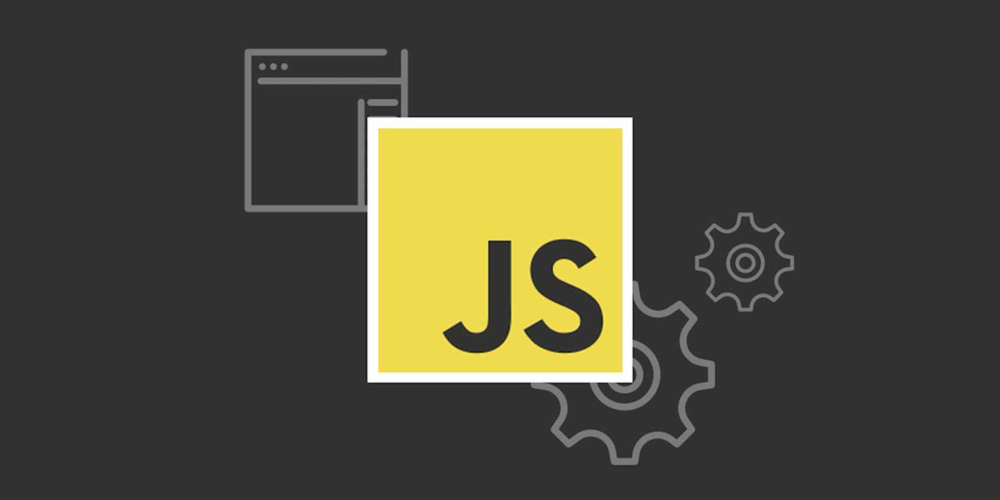

# Циклы `while` и `for` 🏈

При написании скриптов зачастую встаёт задача сделать однотипное действие много раз.

Например, вывести товары из списка один за другим. Или просто перебрать все числа от `1` до `10` и для каждого выполнить одинаковый код.

Для многократного повторения одного участка кода предусмотрены **циклы**.

В этой теме рассматриваются только базовые циклы: `while`, `do..while` и `for(..;..;..)`.

<div align="center">
  
</div>

## 🦜 Цикл `while`

Цикл `while` имеет следующий синтаксис:

```js
while (condition) {
  // код
  // также называемый "телом цикла"
}
```

Код из тела цикла выполняется, пока условие `condition` истинно.

Например, цикл ниже выводит `i`, пока `i < 3`:

```js run
let i = 0;
while (i < 3) { // выводит 0, затем 1, затем 2
  alert( i );
  i++;
}
```

Одно выполнение тела цикла по-научному называется **итерация**. Цикл в примере выше совершает три итерации.

Если бы строка `i++` отсутствовала в примере выше, то цикл бы повторялся (в теории) вечно. На практике, конечно, браузер не позволит такому случиться, он предоставит пользователю возможность остановить "подвисший" скрипт, а **JavaScript** на стороне сервера придётся "убить" процесс.

Любое выражение или переменная может быть условием цикла, а не только сравнение: условие `while` вычисляется и преобразуется в логическое значение.

Например, `while (i)` - более краткий вариант `while (i != 0)`:

```js
let i = 3;

while (i) { // когда i будет равно 0, условие станет ложным, и цикл остановится

  alert( i );
  i--;
}
```

Если тело цикла состоит лишь из одной инструкции, мы можем опустить фигурные скобки `{…}`:

```js 
let i = 3;

while (i) alert(i--);
```

## 🍋 Цикл `do…while`

Проверку условия можно разместить под телом цикла, используя специальный синтаксис `do..while`:

```js
do {
  // тело цикла
} while (condition);
```

Цикл сначала выполнит тело, а затем проверит условие `condition`, и пока его значение равно `true`, он будет выполняться снова и снова.

Например:

```js run
let i = 0;
do {
  alert( i );
  i++;
} while (i < 3);
```

Такая форма синтаксиса оправдана, если вы хотите, чтобы тело цикла выполнилось **хотя бы один раз**, даже если условие окажется ложным. На практике чаще используется форма с предусловием: `while(…) {…}`.

## 🐹 Цикл `for`

Более сложный, но при этом самый распространённый цикл — цикл `for`.

Выглядит он так:

```js
for (начало; условие; шаг) {
  // ... тело цикла ...
}
```

Давайте разберёмся, что означает каждая часть, на примере. Цикл ниже выполняет `alert(i)` для `i` от `0` до (но не включая) `3`:

```js
for (let i = 0; i < 3; i++) { // выведет 0, затем 1, затем 2
  alert(i);
}
```

Рассмотрим конструкцию `for` подробней:

| часть  |          |                                                                            |
|-------|----------|----------------------------------------------------------------------------|
| начало | `let i = 0`    | Выполняется один раз при входе в цикл                                      |
| условие | `i < 3`| Проверяется *перед* каждой итерацией цикла.<br>Если оно вычислится в `false`, цикл остановится.              |
| тело | `alert(i)`      | Выполняется снова и снова, пока условие вычисляется в `true`. |
| шаг | `i++`| Выполняется *после* тела цикла на каждой итерации *перед* проверкой условия.                         |

В целом, алгоритм работы цикла выглядит следующим образом:

```
Выполнить начало
→ (Если условие == true → Выполнить тело, Выполнить шаг)
→ (Если условие == true → Выполнить тело, Выполнить шаг)
→ (Если условие == true → Выполнить тело, Выполнить шаг)
→ ...
```

То есть, `начало` выполняется один раз, а затем каждая итерация заключается в проверке `условия`, после которой выполняется `тело` и `шаг`.

Вот в точности то, что происходит в нашем случае:

```js
// for (let i = 0; i < 3; i++) alert(i)

// Выполнить начало
let i = 0;
// Если условие == true → Выполнить тело, Выполнить шаг
if (i < 3) { alert(i); i++ }
// Если условие == true → Выполнить тело, Выполнить шаг
if (i < 3) { alert(i); i++ }
// Если условие == true → Выполнить тело, Выполнить шаг
if (i < 3) { alert(i); i++ }
// ...конец, потому что теперь i == 3
```

В примере переменная счётчика `i` была объявлена прямо в цикле. Это так называемое "встроенное" объявление переменной. Такие переменные существуют только внутри цикла.

```js run
for (*!*let*/!* i = 0; i < 3; i++) {
  alert(i); // 0, 1, 2
}
alert(i); // ошибка, нет такой переменной
```

Вместо объявления новой переменной мы можем использовать уже существующую:

```js run
let i = 0;

for (i = 0; i < 3; i++) { // используем существующую переменную
  alert(i); // 0, 1, 2
}

alert(i); // 3, переменная доступна, т.к. была объявлена снаружи цикла
```

### 🐝 Пропуск частей `for`

Любая часть `for` может быть пропущена.

Для примера, мы можем пропустить `начало` если нам ничего не нужно делать перед стартом цикла.

Вот так:

```js 
let i = 0; // мы уже имеем объявленную i с присвоенным значением

for (; i < 3; i++) { // нет необходимости в "начале"
  alert( i ); // 0, 1, 2
}
```

Можно убрать и `шаг`:

```js
let i = 0;

for (; i < 3;) {
  alert( i++ );
}
```

Это сделает цикл аналогичным `while (i < 3)`.

А можно и вообще убрать всё, получив бесконечный цикл:

```js
for (;;) {
  // будет выполняться вечно
}
```

При этом сами точки с запятой `;` обязательно должны присутствовать, иначе будет ошибка синтаксиса.

## ❌ Прерывание цикла: `break`

Обычно цикл завершается при вычислении *условия* в `false`.

Но мы можем выйти из цикла в любой момент с помощью специальной директивы `break`.

Например, следующий код подсчитывает сумму вводимых чисел до тех пор, пока посетитель их вводит, а затем – выдаёт:

```js
let sum = 0;

while (true) {

  let value = +prompt("Введите число", '');

  if (!value) break; // (*)

  sum += value;

}
alert( 'Сумма: ' + sum );
```

Директива `break` в строке `(*)` полностью прекращает выполнение цикла и передаёт управление на строку за его телом, то есть на `alert`.

Вообще, сочетание «бесконечный цикл + `break`» – отличная штука для тех ситуаций, когда условие, по которому нужно прерваться, находится не в начале или конце цикла, а посередине или даже в нескольких местах его тела.

## ✅ Переход к следующей итерации: `continue`

Директива `continue` - "облегчённая версия" `break`. При её выполнении цикл не прерывается, а переходит к следующей итерации (если условие все ещё равно `true`).

Её используют, если понятно, что на текущем повторе цикла делать больше нечего.

Например, цикл ниже использует `continue`, чтобы выводить только нечётные значения:

```js
for (let i = 0; i < 10; i++) {

  // если true, пропустить оставшуюся часть тела цикла
    if (i % 2 == 0) continue;

  alert(i); // 1, затем 3, 5, 7, 9
}
```

Для чётных значений `i`, директива `continue` прекращает выполнение тела цикла и передаёт управление на следующую итерацию `for` (со следующим числом). Таким образом `alert` вызывается только для нечётных значений.

Цикл, который обрабатывает только нечётные значения, мог бы выглядеть так:

```js run
for (let i = 0; i < 10; i++) {

  if (i % 2) {
    alert( i );
  }

}
```

С технической точки зрения он полностью идентичен. Действительно, вместо `continue` можно просто завернуть действия в блок `if`.

Однако мы получили дополнительный уровень вложенности фигурных скобок. Если код внутри `if` более длинный, то это ухудшает читаемость, в отличие от варианта с `continue`.

>Обратите внимание, что эти синтаксические конструкции не являются выражениями и не могут быть использованы с тернарным оператором `?`. В частности, использование таких директив, как `break/continue`, вызовет ошибку.

Например, если мы возьмём этот код:

```js
if (i > 5) {
  alert(i);
} else {
  continue;
}
```

...и перепишем его, используя вопросительный знак:

```js 
(i > 5) ? alert(i) : *!*continue*/!*; // continue здесь приведёт к ошибке
```

...то будет синтаксическая ошибка.

Это ещё один повод не использовать оператор вопросительного знака `?` вместо `if`.

## 🔹 Метки для `break`/`continue`

Бывает, нужно выйти одновременно из нескольких уровней цикла сразу.

Например, в коде ниже мы проходимся циклами по `i` и `j`, запрашивая с помощью `prompt` координаты `(i, j)` с `(0,0)` до `(2,2)`:

```js
for (let i = 0; i < 3; i++) {

  for (let j = 0; j < 3; j++) {

    let input = prompt(`Значение на координатах (${i},${j})`, '');

    // Что если мы захотим перейти к Готово (ниже) прямо отсюда?
  }
}

alert('Готово!');
```

Нам нужен способ остановить выполнение, если пользователь отменит ввод.

Обычный `break` после `input` лишь прервёт внутренний цикл, но этого недостаточно. Достичь желаемого поведения можно с помощью меток.

**Метка** имеет вид идентификатора с двоеточием перед циклом:

```js
labelName: for (...) {
  ...
}
```

Вызов `break <labelName>` в цикле ниже ищет ближайший внешний цикл с такой меткой и переходит в его конец.

```js 
outer: for (let i = 0; i < 3; i++) {

  for (let j = 0; j < 3; j++) {

    let input = prompt(`Значение на координатах (${i},${j})`, '');

    // если пустая строка или Отмена, то выйти из обоих циклов
    if (!input) break outer; // (*)

    // сделать что-нибудь со значениями...
  }
}

alert('Готово!');
```

В примере выше это означает, что вызовом `break outer` будет разорван внешний цикл до метки с именем `outer`.

Таким образом управление перейдёт со строки, помеченной `(*)`, к `alert('Готово!')`.

Можно размещать метку на отдельной строке:

```js 
outer:
for (let i = 0; i < 3; i++) { ... }
```

Директива `continue` также может быть использована с меткой. В этом случае управление перейдёт на следующую итерацию цикла с меткой.

Метки не дают возможности передавать управление в произвольное место кода.

Например, нет возможности сделать следующее:

```js
break label; // не прыгает к метке ниже

label: for (...)
```

Директива `break` должна находиться внутри блока кода. Технически, подойдет любой маркированный блок кода, например:

```js
label: {
  // ...
  break label; // работает
  // ...
}
```

...Хотя в 99.9% случаев `break` используется внутри циклов, как мы видели в примерах выше.

К слову, `continue` возможно только внутри цикла.

## 🛟 Итого

Мы рассмотрели 3 вида циклов:

- `while` - Проверяет условие перед каждой итерацией.
- `do..while` - Проверяет условие после каждой итерации.
- `for (;;)` - Проверяет условие перед каждой итерацией, есть возможность задать дополнительные настройки.

Чтобы организовать бесконечный цикл, используют конструкцию `while (true)`. При этом он, как и любой другой цикл, может быть прерван директивой `break`.

Если на данной итерации цикла делать больше ничего не надо, но полностью прекращать цикл не следует – используют директиву `continue`.

Обе этих директивы поддерживают **метки**, которые ставятся перед циклом. Метки – единственный способ для `break/continue` выйти за пределы текущего цикла, повлиять на выполнение внешнего.

Заметим, что метки не позволяют прыгнуть в произвольное место кода, в **JavaScript** нет такой возможности.

---

<div align="center"> Made with ❤️ by <b>dv0retsky</b> </div>