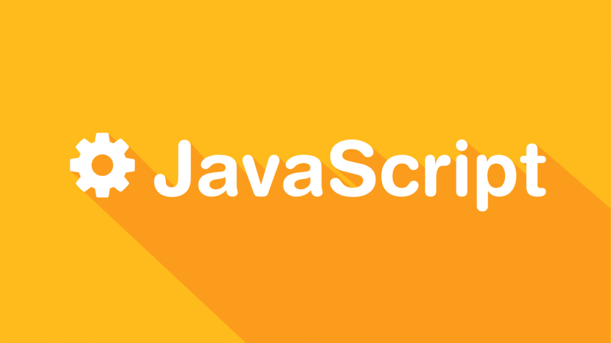

# Тема №1. Введение в JavaScript 📒

**JavaScript** — это язык программирования, который в первую очередь применяют в вебе. С его помощью сайты делают интерактивными: добавляют всплывающие окна, анимацию, кнопки лайков и формы для отправки информации. Его ещё называют главным языком фронтенда — «лицевой» стороны сайта, с которой взаимодействуют пользователи.

  

## 🌟 Для чего нужен JavaScript

- Сделать сайт интерактивным — чтобы это была не просто статичная страница, а динамичная программа, реагирующая на действие пользователей. Например, если нажать кнопку «Нравится» и число лайков на записи увеличивается сразу, без обновления страницы. Это результат использования **JavaScript**.

- Передавать информацию между пользователем и сервером. Именно скрипты, написанные на **JavaScript**, отправляют на сервер информацию, которую ввёл пользователь. 

- Анимировать объекты — добавить скролл до раздела по нажатию кнопки, анимацию фона, движущиеся объекты.

- Производить вычисления. Например, в онлайн-калькуляторе на сайте. Это можно делать как на стороне сервера, так и в самом браузере с помощью возможностей **JavaScript**.

- Писать серверную часть сайта или приложения.

## 🍌 Области применения JavaScript

**Веб-сайты и веб-приложения.** Самая популярная область применения языка **JavaScript** — это написание кода для сайта. Практически на каждом современном сайте используют код, написанный на **JS**.

**Расширения для браузера.** Небольшие простые скрипты, которые добавляют дополнительный функционал — блокируют рекламу, позволяют сохранять аудио, отправляют уведомления о новых письмах или меняют цветовую схему сайта.

**Мобильные приложения.** Их можно писать на специальных языках, например Kotlin. Но если нужно что-то простое, например интерфейс для работы с облачным хранилищем, его можно написать на JavaScript и собрать в приложение с помощью специальных инструментов.

**Серверная часть сайтов и программ.** Язык программирования **JavaScript** можно использовать для написания любых сервисов: чатов, компьютерных программ и даже нейросетей. Для этого к нему нужно подключить движок Node.js. 

**Игры.** На **JS** можно писать несложные браузерные игры.

## 🐝 Как работает JS-код на сайте

**JavaScript** реагирует на действия пользователя на странице. Пользователь нажимает кнопку, это запускает триггер — и тут же срабатывает написанный скрипт.

> Когда происходит событие, **JavaScript** выполняет определённые действия: изменяет содержимое страницы или отправляет данные на сервер

**Сам по себе JavaScript не может чего-то уметь или не уметь — это просто язык программирования. Его возможности зависят от того, что именно ему позволяет браузер.** В современных браузерах **JavaScript-код** может:

- Изменить уже существующий на странице HTML-код или добавить новый, поменять стили. Например, сменить цвет шапки.
- Среагировать на щелчок мыши, перемещение указателя, нажатие клавиш, прокрутку.
- Отправить сетевой запрос на сервер, скачать или загрузить файл. Например, взять присланную пользователем картинку и отправить её на сервер для хранения.
- Задавать пользователю вопросы и показывать сообщения.
- Запоминать данные и хранить их на стороне клиента, в его браузере. Например, сохранить документ в офлайн-режиме, пока пользователь не очистит кэш или не обновит страницу.

## 🌻 Почему стоит учить JavaScript

**Тем, кто планирует стать фронтенд‑разработчиком, — однозначно стоит.** Этот язык будет основным рабочим инструментом. Без JavaScript невозможно разрабатывать ту часть сайтов и веб-приложений, с которой взаимодействуют пользователи. 

У **JS** есть и другие плюсы для изучения:

**Простой в изучении.** Уже через пять минут можно написать и запустить свой первый скрипт. А через пару дней обучения собрать вполне рабочую программу, например расширение для браузера.  

**Хорош как база.** На нём можно освоить основы, единые для всех языков программирования. И потом перейти к изучению других. Особенно хорошо после **JS** идут «С-образные» языки: C++, C#, Java, PHP.  

**Универсален.** Если освоить **Node.js**, можно перейти с фронтенда на бэкенд или в другую сферу разработки.  

**Актуален.** **JS** был создан больше 20 лет назад, но всё ещё развивается и не сдаёт свои позиции как главный язык для фронтенда.  

**Имеет множество надстроек.** CoffeeScript, TypeScript и Dart и другие надстройки делают код компактнее, чище и строже. Их можно изучить, чтобы развиваться в сфере фронтенда. 

---

 Made with ❤️ by <b>dv0retsky</b> 

