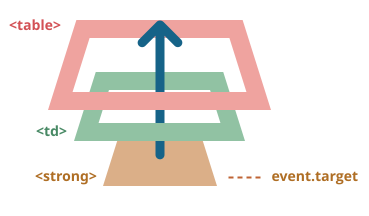

# Тема №28. Делегирование событий 🎀

Всплытие и перехват событий позволяет реализовать один из самых важных приёмов разработки - **делегирование**.

Идея в том, что если у нас есть много элементов, события на которых нужно обрабатывать похожим образом, то вместо того, чтобы назначать обработчик каждому, мы ставим один обработчик на их общего предка.

Из него можно получить целевой элемент `event.target`, понять на каком именно потомке произошло событие и обработать его.

<div align="center">
  
</div>


Рассмотрим пример - [диаграмму Ба-Гуа](https://ru.wikipedia.org/wiki/%D0%92%D0%BE%D1%81%D0%B5%D0%BC%D1%8C_%D1%82%D1%80%D0%B8%D0%B3%D1%80%D0%B0%D0%BC%D0%BC). Это таблица, отражающая древнюю китайскую философию.

Её можно посмотреть обратившись к `index.html` и запустив через `Live Server`!

Её HTML (схематично):

```html
<table>
  <tr>
    <th colspan="3">Квадрат <em>Bagua</em>: Направление, Элемент, Цвет, Значение</th>
  </tr>
  <tr>
    <td>...<strong>Северо-Запад</strong>...</td>
    <td>...</td>
    <td>...</td>
  </tr>
  <tr>...ещё 2 строки такого же вида...</tr>
  <tr>...ещё 2 строки такого же вида...</tr>
</table>
```

В этой таблице всего 9 ячеек, но могло бы быть и 99, и даже 9999, не важно.

**Наша задача - реализовать подсветку ячейки `<td>` при клике.**

Вместо того, чтобы назначать обработчик `onclick` для каждой ячейки `<td>` (их может быть очень много) - мы повесим "единый" обработчик на элемент `<table>`.

Он будет использовать `event.target`, чтобы получить элемент, на котором произошло событие, и подсветить его.

Код будет таким:

```js
let selectedTd;

table.onclick = function(event) {
  let target = event.target; // где был клик?

  if (target.tagName != 'TD') return; // не на TD? тогда не интересует

  highlight(target); // подсветить TD
};

function highlight(td) {
  if (selectedTd) { // убрать существующую подсветку, если есть
    selectedTd.classList.remove('highlight');
  }
  selectedTd = td;
  selectedTd.classList.add('highlight'); // подсветить новый td
}
```

Такому коду нет разницы, сколько ячеек в таблице. Мы можем добавлять, удалять `<td>` из таблицы динамически в любое время, и подсветка будет стабильно работать.

Однако, у текущей версии кода есть недостаток.

Клик может быть не на теге `<td>`, а внутри него.

В нашем случае, если взглянуть на HTML-код таблицы внимательно, видно, что ячейка `<td>` содержит вложенные теги, например `<strong>`:

```html
<td>
  <strong>Северо-Запад</strong>
  ...
</td>
```

Естественно, если клик произойдёт на элементе `<strong>`, то он станет значением `event.target`.

<div align="center">
  
</div>

Внутри обработчика `table.onclick` мы должны по `event.target` разобраться, был клик внутри `<td>` или нет.

Вот улучшенный код:

```js
table.onclick = function(event) {
  let td = event.target.closest('td'); // (1)

  if (!td) return; // (2)

  if (!table.contains(td)) return; // (3)

  highlight(td); // (4)
};
```

Разберём пример:
1. Метод `elem.closest(selector)` возвращает ближайшего предка, соответствующего селектору. В данном случае нам нужен `<td>`, находящийся выше по дереву от исходного элемента.
2. Если `event.target` не содержится внутри элемента `<td>`, то вызов вернёт `null`, и ничего не произойдёт.
3. Если таблицы вложенные, `event.target` может содержать элемент `<td>`, находящийся вне текущей таблицы. В таких случаях мы должны проверить, действительно ли это `<td>` *нашей таблицы*.
4. И если это так, то подсвечиваем его.

В итоге мы получили короткий код подсветки, быстрый и эффективный, которому совершенно не важно, сколько всего в таблице `<td>`.

## 💗 Применение делегирования: действия в разметке

Есть и другие применения делегирования.

Например, нам нужно сделать меню с разными кнопками: "Сохранить (save)", "Загрузить (load)", "Поиск (search)" и т.д. И есть объект с соответствующими методами `save`, `load`, `search`... Как их состыковать?

Первое, что может прийти в голову – это найти каждую кнопку и назначить ей свой обработчик среди методов объекта. Но существует более элегантное решение. Мы можем добавить один обработчик для всего меню и атрибуты `data-action` для каждой кнопки в соответствии с методами, которые они вызывают:

```html
<button data-action="save">Нажмите, чтобы Сохранить</button>
```

Обработчик считывает содержимое атрибута и выполняет метод. Взгляните на рабочий пример:

```html autorun height=60 run untrusted
<div id="menu">
  <button data-action="save">Сохранить</button>
  <button data-action="load">Загрузить</button>
  <button data-action="search">Поиск</button>
</div>

<script>
  class Menu {
    constructor(elem) {
      elem.onclick = this.onClick.bind(this); // (*)
    }

    save() {
      alert('сохраняю');
    }

    load() {
      alert('загружаю');
    }

    search() {
      alert('ищу');
    }

    onClick(event) {
      let action = event.target.dataset.action;
      if (action) {
        this[action]();
      }
    }
  }

  new Menu(menu);
</script>
```

Обратите внимание, что метод `this.onClick` в строке, отмеченной звёздочкой `(*)`, привязывается к контексту текущего объекта `this`. Это важно, т.к. иначе `this` внутри него будет ссылаться на DOM-элемент (`elem`), а не на объект `Menu`, и `this[action]` будет не тем, что нам нужно.

Так что же даёт нам здесь делегирование?

- Не нужно писать код, чтобы присвоить обработчик каждой кнопке. Достаточно просто создать один метод и поместить его в разметку.
- Структура HTML становится по-настоящему гибкой. Мы можем добавлять/удалять кнопки в любое время.

Мы также можем использовать классы `.action-save`, `.action-load`, но подход с использованием атрибутов `data-action` является более семантичным. Их можно использовать и для стилизации в правилах CSS.

## 🛍️ Приём проектирования "поведение"

Делегирование событий можно использовать для добавления элементам "поведения" (behavior), **декларативно** задавая хитрые обработчики установкой специальных HTML-атрибутов и классов.

Приём проектирования "поведение" состоит из двух частей:
1. Элементу ставится пользовательский атрибут, описывающий его поведение.
2. При помощи делегирования ставится обработчик на документ, который ловит все клики (или другие события) и, если элемент имеет нужный атрибут, производит соответствующее действие.

### 🦄 Поведение: "Счётчик"

Например, здесь HTML-атрибут `data-counter` добавляет кнопкам поведение: "увеличить значение при клике":

```html
Счётчик: <input type="button" value="1" data-counter>
Ещё счётчик: <input type="button" value="2" data-counter>

<script>
  document.addEventListener('click', function(event) {

    if (event.target.dataset.counter != undefined) { // если есть атрибут...
      event.target.value++;
    }

  });
</script>
```

Если нажать на кнопку - значение увеличится. Конечно, нам важны не счётчики, а общий подход, который здесь продемонстрирован.

Элементов с атрибутом `data-counter` может быть сколько угодно. Новые могут добавляться в HTML-код в любой момент. При помощи делегирования мы фактически добавили новый "псевдостандартный" атрибут в HTML, который добавляет элементу новую возможность ("поведение").

`addEventListener` для обработчиков на уровне документа"
Когда мы устанавливаем обработчик событий на объект `document`, мы всегда должны использовать метод `addEventListener`, а не `document.on<событие>`, т.к. в случае последнего могут возникать конфликты: новые обработчики будут перезаписывать уже существующие.

Для реального проекта совершенно нормально иметь много обработчиков на элементе `document`, установленных из разных частей кода.

### 👛 Поведение: "Переключатель" (`Toggler`)

Ещё один пример поведения. Сделаем так, что при клике на элемент с атрибутом `data-toggle-id` будет скрываться/показываться элемент с заданным `id`:

```html 
<button data-toggle-id="subscribe-mail">
  Показать форму подписки
</button>

<form id="subscribe-mail" hidden>
  Ваша почта: <input type="email">
</form>

<script>
  document.addEventListener('click', function(event) {
    let id = event.target.dataset.toggleId;
    if (!id) return;

    let elem = document.getElementById(id);

    elem.hidden = !elem.hidden;
  });
</script>
```

Ещё раз подчеркнём, что мы сделали. Теперь для того, чтобы добавить скрытие-раскрытие любому элементу, даже не надо знать **JavaScript**, можно просто написать атрибут `data-toggle-id`.

Это бывает очень удобно - не нужно писать JavaScript-код для каждого элемента, который должен так себя вести. Просто используем поведение. Обработчики на уровне документа сделают это возможным для элемента в любом месте страницы.

Мы можем комбинировать несколько вариантов поведения на одном элементе.

Шаблон "поведение" может служить альтернативой для фрагментов JS-кода в вёрстке.

## 💕 Итого

Делегирование событий - это здорово! Пожалуй, это один из самых полезных приёмов для работы с DOM.

Он часто используется, если есть много элементов, обработка которых очень схожа, но не только для этого.

Алгоритм:

1. Вешаем обработчик на контейнер.
2. В обработчике проверяем исходный элемент `event.target`.
3. Если событие произошло внутри нужного нам элемента, то обрабатываем его.

Зачем использовать:

- **Упрощает процесс инициализации и экономит память:** не нужно вешать много обработчиков.

- **Меньше кода:** при добавлении и удалении элементов не нужно ставить или снимать обработчики.

- **Удобство изменений DOM:** можно массово добавлять или удалять элементы путём изменения `innerHTML` и ему подобных.

Конечно, у делегирования событий есть свои ограничения:

- Во-первых, событие должно всплывать. Некоторые события этого не делают. Также, низкоуровневые обработчики не должны вызывать `event.stopPropagation()`.

- Во-вторых, делегирование создаёт дополнительную нагрузку на браузер, ведь обработчик запускается, когда событие происходит в любом месте контейнера, не обязательно на элементах, которые нам интересны. Но обычно эта нагрузка настолько пустяковая, что её даже не стоит принимать во внимание.

## 😈 Задачи для практики

### 🔹 Задача 1. Раскрывающееся дерево

Создайте дерево, которое по клику на заголовок скрывает-показывает потомков:

```html
<!DOCTYPE HTML>
<html>
<head>
  <meta charset="utf-8">
</head>
<body>

  <ul class="tree" id="tree">
    <li>Животные
      <ul>
        <li>Млекопитающие
          <ul>
            <li>Коровы</li>
            <li>Ослы</li>
            <li>Собаки</li>
            <li>Тигры</li>
          </ul>
        </li>
        <li>Другие
          <ul>
            <li>Змеи</li>
            <li>Птицы</li>
            <li>Ящерицы</li>
          </ul>
        </li>
      </ul>
    </li>
    <li>Рыбы
      <ul>
        <li>Аквариумные
          <ul>
            <li>Гуппи</li>
            <li>Скалярии</li>
          </ul>
        </li>
        <li>Морские
          <ul>
            <li>Морская форель</li>
          </ul>
        </li>
      </ul>
    </li>
  </ul>

</body>
</html>
```

**Требования:**

- Использовать только один обработчик событий (применить делегирование)
- Клик вне текста заголовка (на пустом месте) ничего делать не должен.

### 🔹 Задача 2. Сортируемая таблица

Сделать таблицу сортируемой: при клике на элемент `<th>` строки таблицы должны сортироваться по соответствующему столбцу.

Каждый элемент `<th>` имеет атрибут `data-type`:

```html
<table id="grid">
  <thead>
    <tr>
      <th data-type="number">Возраст</th>
      <th data-type="string">Имя</th>
    </tr>
  </thead>
  <tbody>
    <tr>
      <td>5</td>
      <td>Вася</td>
    </tr>
    <tr>
      <td>10</td>
      <td>Петя</td>
    </tr>
    ...
  </tbody>
</table>
```

В примере выше первый столбец содержит числа, а второй – строки. Функция сортировки должна это учитывать, ведь числа сортируются иначе, чем строки.

Сортировка должна поддерживать только типы `"string"` и `"number"`.

```html
<!DOCTYPE HTML>
<html>

<head>
  <meta charset="utf-8">
  <style>
    table {
       border-collapse: collapse;
     }
     th, td {
       border: 1px solid black;
       padding: 4px;
     }
     th {
       cursor: pointer;
     }
     th:hover {
       background: yellow;
     }
  </style>
</head>

<body>

  <table id="grid">
    <thead>
      <tr>
        <th data-type="number">Возраст</th>
        <th data-type="string">Имя</th>
      </tr>
    </thead>
    <tbody>
      <tr>
        <td>5</td>
        <td>Вася</td>
      </tr>
      <tr>
        <td>2</td>
        <td>Петя</td>
      </tr>
      <tr>
        <td>12</td>
        <td>Женя</td>
      </tr>
      <tr>
        <td>9</td>
        <td>Маша</td>
      </tr>
      <tr>
        <td>1</td>
        <td>Илья</td>
      </tr>
    </tbody>
  </table>

  <script>
    // ...ваш код...
  </script>

</body>
</html>
```

### 🔹 Задача 3. Поведение "подсказка"

Напишите JS-код, реализующий поведение «подсказка».

При наведении мыши на элемент с атрибутом `data-tooltip`, над ним должна показываться подсказка и скрываться при переходе на другой элемент.

Пример HTML с подсказками:

```html
<button data-tooltip="эта подсказка длиннее, чем элемент">Короткая кнопка</button>
<button data-tooltip="HTML<br>подсказка">Ещё кнопка</button>
```

В этой задаче мы полагаем, что во всех элементах с атрибутом `data-tooltip` – только текст. То есть, в них нет вложенных тегов (пока).

Детали оформления:

- Отступ от подсказки до элемента с `data-tooltip` должен быть `5px` по высоте.
- Подсказка должна быть, по возможности, посередине элемента.
- Подсказка не должна вылезать за границы экрана, в том числе если страница частично прокручена, если нельзя показать сверху – показывать снизу элемента.
- Текст подсказки брать из значения атрибута `data-tooltip`. Это может быть произвольный HTML.

Для решения вам понадобятся два события:

- `mouseover` срабатывает, когда указатель мыши заходит на элемент.
- `mouseout  срабатывает, когда указатель мыши уходит с элемента.

Примените делегирование событий: установите оба обработчика на элемент `document`, чтобы отслеживать «заход» и «уход» курсора на элементы с атрибутом `data-tooltip` и управлять подсказками с их же помощью.

После реализации поведения – люди, даже не знакомые с **JavaScript** смогут добавлять подсказки к элементам.

P.S. В один момент может быть показана только одна подсказка.

```html
<!DOCTYPE HTML>
<html>

<head>
  <meta charset="utf-8">
  <style>
    body {
      height: 2000px;
      /* добавим body прокрутку, подсказка должна работать и с прокруткой */
    }

    .tooltip {
      /* немного стилизуем подсказку, можете использовать свои стили вместо этих */
      position: fixed;
      padding: 10px 20px;
      border: 1px solid #b3c9ce;
      border-radius: 4px;
      text-align: center;
      font: italic 14px/1.3 sans-serif;
      color: #333;
      background: #fff;
      box-shadow: 3px 3px 3px rgba(0, 0, 0, .3);
    }
  </style>
</head>

<body>

  <p>ЛяЛяЛя ЛяЛяЛя ЛяЛяЛя ЛяЛяЛя ЛяЛяЛя ЛяЛяЛя ЛяЛяЛя ЛяЛяЛя ЛяЛяЛя</p>
  <p>ЛяЛяЛя ЛяЛяЛя ЛяЛяЛя ЛяЛяЛя ЛяЛяЛя ЛяЛяЛя ЛяЛяЛя ЛяЛяЛя ЛяЛяЛя</p>

  <button data-tooltip="эта подсказка должна быть длиннее, чем элемент">Короткая кнопка</button>
  <button data-tooltip="HTML<br>подсказка">Ещё кнопка</button>

  <p>Прокрутите страницу, чтобы кнопки оказались у верхнего края, а затем проверьте правильно ли выводятся подсказки.</p>


  <script>
    // ...ваш код...
  </script>

</body>
</html>
```

---

<div align="center"> Made with ❤️ by <b>dv0retsky</b> </div>