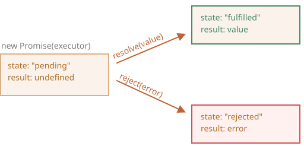
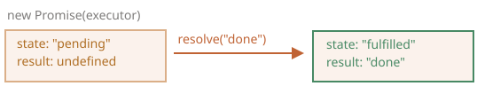
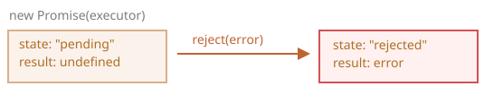

## Тема №35. Промисы 🐣

Представь, что ты заказываешь пиццу через приложение доставки (промис).

- **Ты делаешь заказ и получаешь номер отслеживания.** Это как создание промиса. Приложение (промис) тебе еще не отдает пиццу, но оно дает тебе обещание (Promise), что пицца будет доставлена. На этом этапе промис находится в состоянии `pending` («ожидание»).

- **Ты продолжаешь заниматься своими делами.** Ты не стоишь у окна и не смотришь на улицу. Твой код (ты) не «блокируется». Ты можешь листать ленту, смотреть тиктоки или играть в игру. Это асинхронность в действии.

- Через какое-то время с промисом происходит одно из двух:

    - **Вариант УСПЕХ: Курьер привозит твою пиццу.**
    Ты получаешь горячую, вкусную пиццу (данные). Промис переходит в состояние `fulfilled` («выполнено успешно»). Чтобы отреагировать на успех, ты используешь метод .then() — по сути, говоришь: «Когда пицца приедет, `then` (тогда) я ее съем».
    - **Вариант НЕУДАЧА: С пиццей что-то пошло не так.**
Например, у ресторана закончилось тесто или курьер попал в пробку. Промис переходит в состояние `rejected` («выполнено с ошибкой»). Чтобы обработать эту ситуацию, ты используешь метод `.catch()`. Это как сказать: «Если пиццу не привезут, catch (поймаю) эту ошибку и сделаю что-то еще (например, закажу суши)».

```js
// Создаём промис (делаем заказ в приложении)
let pizzaDelivery = new Promise((resolve, reject) => {
  // Имитируем время готовки и доставки
  let isSuccessful = Math.random() > 0.2; // В 80% случаев всё ок

  setTimeout(() => {
    if (isSuccessful) {
      resolve("Твоя пицца 'Пепперони' у курьера!"); // Промис выполнен (fulfilled)
    } else {
      reject("Извини, у нас сломался духовой шкаф :("); // Промис отклонен (rejected)
    }
  }, 3000);
});

// Используем промис (ждём и реагируем)
pizzaDelivery
  .then((successMessage) => {
    // Срабатывает при успехе (когда resolve)
    console.log("Ура! " + successMessage);
    console.log("Начинаю уплетать за обе щёки!");
  })
  .catch((errorMessage) => {
    // Срабатывает при ошибке (когда reject)
    console.log("Ошибка: " + errorMessage);
    console.log("Придется заказать роллы...");
  });
  ```

<div align="center">
  
</div>

Это аналогия из реальной жизни для ситуаций, с которыми мы часто сталкиваемся в программировании:

1. Есть "создающий" код, который делает что-то, что занимает время. Например, загружает данные по сети.
2. Есть "потребляющий" код, который хочет получить результат "создающего" кода, когда он будет готов. Он может быть необходим более чем одной функции.
3. `Promise` - это специальный объект в **JavaScript**, который связывает "создающий" и "потребляющий" коды вместе. В терминах нашей аналогии - это "список для подписки". "Создающий" код может выполняться сколько потребуется, чтобы получить результат, а **промис** делает результат доступным для кода, который подписан на него, когда результат готов.

Аналогия не совсем точна, потому что объект `Promise` в **JavaScript** гораздо сложнее простого списка подписок: он обладает дополнительными возможностями и ограничениями. Но для начала и такая аналогия хороша.

Синтаксис создания `Promise`:

```js
let promise = new Promise(function(resolve, reject) {
  // функция-исполнитель (executor)
  // "певец"
});
```

Функция, переданная в конструкцию `new Promise`, называется **исполнитель** (executor). Когда `Promise` создаётся, она запускается автоматически. Она должна содержать "создающий" код, который когда-нибудь создаст результат.

Её аргументы `resolve` и `reject` - это колбэки, которые предоставляет сам **JavaScript**. Наш код - только внутри исполнителя.

Когда он получает результат, сейчас или позже - не важно, он должен вызвать один из этих колбэков:

- `resolve(value)` — если работа завершилась успешно, с результатом `value`.
- `reject(error)` — если произошла ошибка, `error` - объект ошибки.

Итак, исполнитель запускается автоматически, он должен выполнить работу, а затем вызвать `resolve` или `reject`.

У объекта `promise`, возвращаемого конструктором `new Promise`, есть внутренние свойства:

- `state` ("состояние") — вначале `"pending"` ("ожидание"), потом меняется на  `"fulfilled"` ("выполнено успешно") при вызове `resolve` или на `"rejected"` ("выполнено с ошибкой") при вызове `reject`.
- `result` ("результат") — вначале `undefined`, далее изменяется на `value` при вызове `resolve(value)` или на `error` при вызове `reject(error)`.

Так что исполнитель по итогу переводит `promise` в одно из двух состояний:

<div align="center">
  
</div>

Позже мы рассмотрим, как "фанаты" узнают об этих изменениях.

Ниже пример конструктора `Promise` и простого исполнителя с кодом, дающим результат с задержкой (через `setTimeout`):

```js
let promise = new Promise(function(resolve, reject) {
  // эта функция выполнится автоматически, при вызове new Promise

  // через 1 секунду сигнализировать, что задача выполнена с результатом "done"
  setTimeout(() => *!*resolve("done")*/!*, 1000);
});
```

Мы можем наблюдать две вещи, запустив код выше:

1. Функция-исполнитель запускается сразу же при вызове `new Promise`.
2. Исполнитель получает два аргумента: `resolve` и `reject` — это функции, встроенные в JavaScript, поэтому нам не нужно их писать. Нам нужно лишь позаботиться, чтобы исполнитель вызвал одну из них по готовности.

Спустя одну секунду "обработки" исполнитель вызовет `resolve("done")`, чтобы передать результат:

<div align="center">
  
</div>

Это был пример успешно выполненной задачи, в результате мы получили "успешно выполненный" промис.

А теперь пример, в котором исполнитель сообщит, что задача выполнена с ошибкой:

```js
let promise = new Promise(function(resolve, reject) {
  // спустя одну секунду будет сообщено, что задача выполнена с ошибкой
  setTimeout(() => *!*reject(new Error("Whoops!"))*/!*, 1000);
});
```

<div align="center">
  
</div>

Подведём промежуточные итоги: исполнитель выполняет задачу (что-то, что обычно требует времени), затем вызывает `resolve` или `reject`, чтобы изменить состояние соответствующего `Promise`.

Промис - и успешный, и отклонённый будем называть "завершённым", в отличие от изначального промиса "в ожидании".

Исполнитель должен вызвать что-то одно: `resolve` или `reject`. Состояние промиса может быть изменено только один раз.

Все последующие вызовы `resolve` и `reject` будут проигнорированы:

```js
let promise = new Promise(function(resolve, reject) {
  resolve("done");

  reject(new Error("…")); // игнорируется
  setTimeout(() => resolve("…")); // игнорируется
});
```

Идея в том, что задача, выполняемая исполнителем, может иметь только один итог: результат или ошибку.

Также заметим, что функция `resolve`/`reject` ожидает только один аргумент (или ни одного). Все дополнительные аргументы будут проигнорированы.

В случае, если что-то пошло не так, мы должны вызвать `reject`. Это можно сделать с аргументом любого типа (как и `resolve`), но рекомендуется использовать объект `Error` (или унаследованный от него). Почему так? Скоро нам станет понятно.

Обычно исполнитель делает что-то асинхронное и после этого вызывает `resolve`/`reject`, то есть через какое-то время. Но это не обязательно, `resolve` или `reject` могут быть вызваны сразу:

```js
let promise = new Promise(function(resolve, reject) {
  // задача, не требующая времени
  resolve(123); // мгновенно выдаст результат: 123
});
```

Это может случиться, например, когда мы начали выполнять какую-то задачу, но тут же увидели, что ранее её уже выполняли, и результат закеширован.

Такая ситуация нормальна. Мы сразу получим успешно завершённый `Promise`.

Свойства `state` и `result` - это внутренние свойства объекта `Promise` и мы не имеем к ним прямого доступа. Для обработки результата следует использовать методы `.then`/`.catch`/`.finally`, про них речь пойдёт дальше.

## 🥥 Потребители: `then`, `catch`

Объект `Promise` служит связующим звеном между исполнителем ("создающим" кодом или "певцом") и функциями-потребителями ("фанатами"), которые получат либо результат, либо ошибку. Функции-потребители могут быть зарегистрированы (подписаны) с помощью методов `.then` и `.catch`.

### ⭐️ `then`

Наиболее важный и фундаментальный метод - `.then`.

Синтаксис:

```js
promise.then(
  function(result) {/* обработает успешное выполнение */},
  function(error) {/* обработает ошибку */}
);
```

Первый аргумент метода `.then` - функция, которая выполняется, когда промис переходит в состояние "выполнен успешно", и получает результат.

Второй аргумент `.then`  - функция, которая выполняется, когда промис переходит в состояние "выполнен с ошибкой", и получает ошибку.

Например, вот реакция на успешно выполненный промис:

```js run
let promise = new Promise(function(resolve, reject) {
  setTimeout(() => resolve("done!"), 1000);
});

// resolve запустит первую функцию, переданную в .then
promise.then(
  result => alert(result), // выведет "done!" через одну секунду
  error => alert(error) // не будет запущена
);
```

Выполнилась первая функция.

А в случае ошибки в промисе - выполнится вторая:

```js
let promise = new Promise(function(resolve, reject) {
  setTimeout(() => reject(new Error("Whoops!")), 1000);
});

// reject запустит вторую функцию, переданную в .then
promise.then(
  result => alert(result), // не будет запущена
  error => alert(error) // выведет "Error: Whoops!" спустя одну секунду
);
```

Если мы заинтересованы только в результате успешного выполнения задачи, то в `then` можно передать только одну функцию:

```js run
let promise = new Promise(resolve => {
  setTimeout(() => resolve("done!"), 1000);
});

promise.then(alert); // выведет "done!" спустя одну секунду
```

### 🔥 `catch`

Если мы хотели бы только обработать ошибку, то можно использовать `null` в качестве первого аргумента: `.then(null, errorHandlingFunction)`. Или можно воспользоваться методом `.catch(errorHandlingFunction)`, который сделает то же самое:

```js run
let promise = new Promise((resolve, reject) => {
  setTimeout(() => reject(new Error("Ошибка!")), 1000);
});

// .catch(f) это то же самое, что promise.then(null, f)
promise.catch(alert); // выведет "Error: Ошибка!" спустя одну секунду
```

Вызов `.catch(f)` - это сокращённый, "укороченный" вариант  `.then(null, f)`.

## 🚀 Очистка: `finally`

По аналогии с блоком `finally` из обычного `try {...} catch {...}`, у промисов также есть метод `finally`.

Вызов `.finally(f)` похож на `.then(f, f)`, в том смысле, что `f` выполнится в любом случае, когда промис завершится: успешно или с ошибкой.

Идея `finally` состоит в том, чтобы настроить обработчик для выполнения очистки/доведения после завершения предыдущих операций.

Например, остановка индикаторов загрузки, закрытие больше не нужных соединений и т.д.

Думайте об этом как о завершении вечеринки. Независимо от того, была ли вечеринка хорошей или плохой, сколько на ней было друзей, нам все равно нужно (или, по крайней мере, мы должны) сделать уборку после нее.

Код может выглядеть следующим образом:

```js
new Promise((resolve, reject) => {
  /* сделать что-то, что займёт время, и после вызвать resolve или может reject */
})
  // выполнится, когда промис завершится, независимо от того, успешно или нет
  .finally(() => остановить индикатор загрузки)
  // таким образом, индикатор загрузки всегда останавливается, прежде чем мы продолжим
  .then(result => показать результат, err => показать ошибку)
```

Обратите внимание, что `finally(f)` - это не совсем псевдоним `then(f,f)`, как можно было подумать.

Есть важные различия:

1. Обработчик, вызываемый из `finally`, не имеет аргументов. В `finally` мы не знаем, как был завершён промис. И это нормально, потому что обычно наша задача - выполнить "общие" завершающие процедуры.

    Пожалуйста, взгляните на приведенный выше пример: как вы можете видеть, обработчик `finally` не имеет аргументов, а результат промиса обрабатывается в следующем обработчике.

2. Обработчик `finally` "пропускает" результат или ошибку дальше, к последующим обработчикам.

    Например, здесь результат проходит через `finally` к `then`:
    
    ```js run
    new Promise((resolve, reject) => {
      setTimeout(() => resolve("value"), 2000);
    })
      .finally(() => alert("Промис завершён")) // срабатывает первым
      .then(result => alert(result)); // <-- .then показывает "value"
    ```
    
    Как вы можете видеть, значение возвращаемое первым промисом, передается через `finally` к следующему `then`.
    
    Это очень удобно, потому что `finally` не предназначен для обработки результата промиса. Как уже было сказано, это место для проведения общей очистки, независимо от того, каков был результат.
    
    А здесь ошибка из промиса проходит через `finally` к `catch`:

    ```js run
    new Promise((resolve, reject) => {
      throw new Error("error");
    })
      .finally(() => alert("Промис завершён")) // срабатывает первым
      .catch(err => alert(err));  // <-- .catch показывает ошибку
    ```  

3. Обработчик `finally` также не должен ничего возвращать. Если это так, то возвращаемое значение молча игнорируется.

    Единственным исключением из этого правила является случай, когда обработчик `finally` выдает ошибку. Затем эта ошибка передается следующему обработчику вместо любого предыдущего результата.
    
Подведем итог:

- Обработчик `finally` не получает результат предыдущего обработчика (у него нет аргументов). Вместо этого этот результат передается следующему подходящему обработчику.
- Если обработчик `finally` возвращает что-то, это игнорируется.
- Когда `finally` выдает ошибку, выполнение переходит к ближайшему обработчику ошибок.

Эти функции полезны и заставляют все работать правильно, если мы используем `finally` так, как предполагается: для общих процедур очистки.

Если промис в состоянии ожидания, обработчики в `.then/catch/finally` будут ждать его.

Иногда может случиться так, что промис уже выполнен, когда мы добавляем к нему обработчик.

В таком случае эти обработчики просто запускаются немедленно:

```js run
// при создании промиса он сразу переводится в состояние "успешно завершён"
let promise = new Promise(resolve => resolve("готово!"));

promise.then(alert); // готово! (выведется сразу)
```

## 🧸 Пример: `loadScript`

Теперь рассмотрим несколько практических примеров того, как промисы могут облегчить нам написание асинхронного кода.

У нас есть функция `loadScript` для загрузки скрипта из предыдущей главы.

Давайте вспомним, как выглядел вариант с колбэками:

```js
function loadScript(src, callback) {
  let script = document.createElement('script');
  script.src = src;

  script.onload = () => callback(null, script);
  script.onerror = () => callback(new Error(`Ошибка загрузки скрипта ${src}`));

  document.head.append(script);
}
```

Теперь перепишем её, используя `Promise`.

Новой функции `loadScript` более не нужен аргумент `callback`. Вместо этого она будет создавать и возвращать объект `Promise`, который перейдет в состояние "успешно завершён", когда загрузка закончится. Внешний код может добавлять обработчики ("подписчиков"), используя `.then`:

```js run
function loadScript(src) {  
  return new Promise(function(resolve, reject) {
    let script = document.createElement('script');
    script.src = src;

    script.onload = () => resolve(script);
    script.onerror = () => reject(new Error(`Ошибка загрузки скрипта ${src}`));

    document.head.append(script);
  });
}
```

Применение:

```js run
let promise = loadScript("https://cdnjs.cloudflare.com/ajax/libs/lodash.js/4.17.11/lodash.js");

promise.then(
  script => alert(`${script.src} загружен!`),
  error => alert(`Ошибка: ${error.message}`)
);

promise.then(script => alert('Ещё один обработчик...'));
```

Сразу заметно несколько преимуществ перед подходом с использованием колбэков:


| Промисы | Колбэки |
|----------|-----------|
| Промисы позволяют делать вещи в естественном порядке. Сперва мы запускаем `loadScript(script)`, и затем (`.then`) мы пишем, что делать с результатом. | У нас должна быть функция`callback` на момент вызова `loadScript(script, callback)`. Другими словами, нам нужно знать что делать с результатом *до того*, как вызовется `loadScript`. |
| Мы можем вызывать `.then` у `Promise` столько раз, сколько захотим. Каждый раз мы добавляем нового "фаната", новую функцию-подписчика в "список подписок".| Колбэк может быть только один. |

Таким образом, промисы позволяют улучшить порядок кода и дают нам гибкость. Но это далеко не всё. Мы узнаем ещё много полезного.

---

<div align="center"> Made with ❤️ by <b>dv0retsky</b> </div>