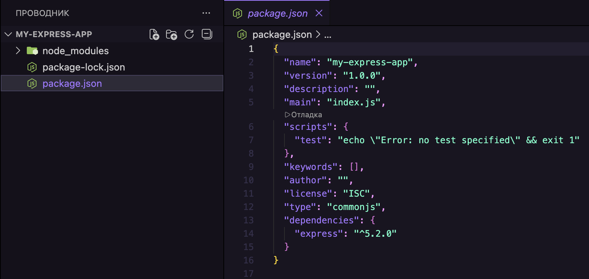
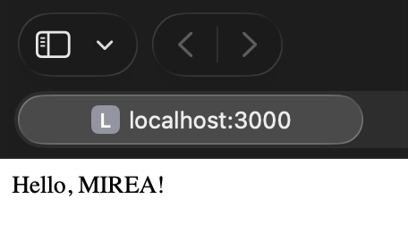

## Тема №39. Знакомство с Express.js 🍍

Чтобы сохранять данные, обрабатывать формы, авторизовать пользователей или делать что-то на сайте, нужен бэкенд — сервер, который будет принимать запросы, хранить информацию и отдавать её обратно на фронтенд.

Один из самых популярных инструментов для этого — **фреймворк Express.js.** Он позволяет быстро развернуть сервер, настроить маршруты, обрабатывать запросы и работать с API.

Сегодня разберем, как работает **Express.js**, зачем он нужен и как создать свой сервер. Фронтендерам тоже пригодится, чтобы понимать, как приходят и уходят данные с сервера, как работать с API и лучше взаимодействовать с бэкенд-разработчиками.

<div align="center">
  
</div>

## 📒 Введение в Express.js

[**Express.js**](https://expressjs.com) — это бэкенд-фреймворк для **Node.js**, который работает на сервере и позволяет:
- Принимать и обрабатывать запросы от браузера (например, когда пользователь заходит на сайт или отправляет форму).
- Хранить данные (в базе данных или файлах).
- Передавать данные обратно на фронтенд (список товаров в интернет-магазине и т. п.).

Если сайт должен просто красиво выглядеть — **Express.js** не нужен. Но если он должен что-то делать, обрабатывать данные, хранить их и взаимодействовать с пользователем на глубоком уровне — то пригодится.

## 🧸 Установка Express.js

Перед тем как установить **Express**, нам понадобится **Node.js** — среда для выполнения **JS**. Без нее ничего работать не будет, потому что **Express** — это фреймворк для **Node.js**.

Чтобы проверить установку, вводим в терминал или командную строку команду:

```bash
node -v
```

Если выдает номер версии, то все ок. Если нет, то устанавливаем **Node.js**.

- Переходим на [**официальный сайт Node.js**](https://nodejs.org/uk) и качаем LTS-версию (она стабильнее).
- Устанавливаем как обычную программу (всё по умолчанию, можно просто нажимать «Далее»).
- Снова проверяем установку: `node -v`.

Теперь нужно создать папку для проекта и перейти в неё:

```bash
mkdir my-express-app
cd my-express-app
```

Здесь будет лежать весь код нашего будущего приложения.

### 📝 Создание `package.json`

`package.json` — это файл, который хранит всю информацию о нашем проекте: какие пакеты установлены, какие зависимости нужны и как его запускать. Вводим команду:

```bash
npm init -y
```

Это автоматически создаст `package.json` с базовыми настройками.

### ⏱️ Установка Express

Теперь ставим сам **Express**:

```bash
npm install express
```

После этого в `package.json` появится зависимость "express", а в папке `node_modules` — его файлы:

<div align="center">
  
</div>

Готово! Теперь у нас есть установленный **Express.js**, и можно писать первый сервер.

## 🖱️ Создание простого веб-приложения

Запустим свой первый сервер и заставим его отвечать пользователю. По традиции начнем с `Hello, MIREA!`.

В корне проекта создаём новый файл `server.js`. Можно вручную или через терминал:

```bash
touch server.js
```

В файл `server.js` добавляем такой код (это минимальная конфигурация сервера):

```js
// Подключаем Express
const express = require("express");
// Создаем приложение
const app = express();
// Определяем порт
const port = 3000;
// Маршрут для главной страницы
app.get("/", (req, res) => {
 res.send("Hello, MIREA!");
});
// Запускаем сервер
app.listen(port, () => {
 console.log(`Сервер запущен на http://localhost:${port}`);
});
```

Вот что тут происходит:

- Подключаем **Express** — берём его из `node_modules` и загружаем в переменную.
- Создаем серверное приложение с помощью `express()`.
- Определяем маршрут (`app.get(‘/’)`) — если пользователь заходит на http://localhost:3000/, сервер отправляет ему «`Hello, MIREA!`».
- Запускаем сервер на 3000-м порту.

Теперь проверим, как это работает. Запускаем сервер командой:

```bash
node server.js
```

В консоли должно появится сообщение:

```bash
Сервер запущен на http://localhost:3000
```

Откроем в браузере http://localhost:3000/ и на странице увидим `Hello, MIREA`!

<div align="center">
  
</div>

Пока наш сервер умеет отвечать только одной строкой текста. Дальше научим его обрабатывать разные запросы, работать с маршрутами, передавать данные и делать другие штуки.

## 📲 Работа с роутами

Мы уже умеем запускать сервер, но пока он отвечает только "`Hello, MIREA!`" на один единственный запрос. Но когда мы создаем полноценный сайт, там много разных страниц и соответственно запросов: главная, страница о компании, контакты, каталог товаров и так далее.

Здесь и нужна маршрутизация — благодаря ей сервер понимает, на какой URL зашёл пользователь и какой контент ему нужно отдать. Например, если кто-то открывает `/about`, Express должен показать страницу «О нас», а если `/contact` — страницу с контактами. Собственно, роуты — это как раз те маршруты, по которым проходит сервер, чтобы собрать и отдать пользователю нужную страницу.

Разберемся, как это настроить.

### 🧃 Методы маршрутизации

В **Express** есть стандартные методы HTTP-запросов, которые позволяют серверу взаимодействовать с клиентом. То есть, это разные способы, с помощью которых браузер или другое приложение может запросить или отправить данные на сервер. Без HTTP-методов веб-приложения просто не работают.

В **Express** это может выглядеть так:

```js
// Обрабатываем GET-запрос на главную страницу
app.get('/', (req, res) => {
// Отправляем текстовый ответ
  res.send('Это главная страница!'); 
});
// Обрабатываем POST-запрос (отправку формы)
app.post('/submit', (req, res) => {
// Сервер подтверждает прием данных
  res.send('Форма отправлена!'); 
});
// Обрабатываем PUT-запрос (обновление данных)
app.put('/update', (req, res) => {
// Сообщаем, что данные изменены
  res.send('Данные обновлены!'); 
});
// Обрабатываем DELETE-запрос (удаление данных)
app.delete('/delete', (req, res) => {
// Подтверждаем, что данные удалены
  res.send('Данные удалены!'); 
});
```

GET-запросы можно отправлять и тестировать прямо в браузере, поскольку они не изменяют данные, а вот для POST, PUT, DELETE нужен Postman или фронтенд с `fetch()`.

### 🌸 Параметры маршрутов

Иногда нужно передавать в URL динамические данные, например, загрузить профиль конкретного пользователя. Чтобы не делать один общий маршрут `/users` и не загружать всех пользователей разом, мы можем создать отдельные страницы, например, `/users/42` для пользователя с ID 42.

Для этого нужны параметры маршрутов. Они позволяют передавать значения прямо в URL и обрабатывать их в Express.

Когда в **Express** создается маршрут с двоеточием (:), это означает, что эта часть URL становится переменной, и **Express** ожидает, что вместо неё будет подставлено какое-то конкретное значение.

Например:

```js
app.get('/users/:id', (req, res) => {
  res.send(`Профиль пользователя с ID: ${req.params.id}`);
});
```

В этом примере `/users/:id` — это динамический маршрут, где `:id` — переменная, которая будет заменяться реальным значением из URL.

Это работает так: если кто-то заходит на `/users/42`, Express автоматически извлекает число `42`, сохраняет его в объекте `req.params`, а затем `req.params.id` подставляет это значение в ответ.

В итоге сервер отправит:

```bash
Профиль пользователя с ID: 42
```

Короче, удобно, когда нужно передавать ID пользователя, категорию товаров или другие данные прямо в URL.

## 🍇 Использование мидлвар (промежуточных обработчиков)

**Express** хорош не только тем, что позволяет быстро настроить сервер, но и тем, что можно гибко управлять процессом обработки запроса. За это отвечают `middleware` (мидлвары) — специальные функции, которые выполняются между запросом и ответом.

Мидлвар делает следующее:

- Меняет объект запроса (`req`) или ответа (`res`).
- Может передать управление дальше (если вызвать `next()`).
- Иногда завершает обработку запроса (например, если есть ошибка).

По сути, **Express** — это цепочка мидлваров, через которую проходит каждый запрос.

### 🥝 Общие мидлвары

**Express** уже включает несколько встроенных мидлваров. Посмотрим на самые часто используемые:

👉 **express.json () — для обработки JSON-данных**

Когда клиент отправляет POST-запрос с JSON-объектом, Express по умолчанию не умеет его читать. Если не подключить мидлвар, `req.body` просто будет `undefined`.

Этот мидлвар парсит JSON и делает его доступным в `req.body`:

```js
app.use(express.json());
Теперь можно получать JSON-данные так:
app.post("/data", (req, res) => {
// Здесь уже будет распарсенный объект
  console.log(req.body); 
  res.send("Данные получены!");
});
```

👉 **express.urlencoded () — для обработки данных из форм**

Когда пользователь отправляет форму (например, login или обратная связь), браузер кодирует данные в URL-формате (application/x-www-form-urlencoded). Но чтобы **Express** смог распарсить данные формы, нужен мидлвар:

```js
app.use(express.urlencoded({ extended: true }));
Теперь можно обрабатывать данные формы:
app.post("/login", (req, res) => {
  console.log(req.body); // { username: "admin", password: "123456" }
  res.send(`Добро пожаловать, ${req.body.username}!`);
});
```

Разница с предыдущим мидлваром в том, что:

- `express.json()` нужен, когда данные приходят в формате JSON (от `fetch()` или `Axios`).
- `express.urlencoded()` используется, когда данные приходят из HTML-формы с `method="POST"`.

👉 **express.static () — для раздачи файлов**

Если нужно отдать пользователю картинки, стили, скрипты — используем `express.static()`.

```js
app.use(express.static(“public”));
```

Так файлы из папки public будут доступны в браузере. Например, `public/logo.png` будет доступен по `/logo.png`.

### 🥥 Сторонние мидлвары

Иногда встроенных мидлваров недостаточно, и тогда подключаем дополнительные. Их нужно устанавливать через `npm install`.

👉 **bodyParser**

Раньше в **Express** не было встроенного JSON-парсера, и все использовали `body-parser`:

```js
const bodyParser = require(“body-parser”);
app.use(bodyParser.json());
```

Но сейчас **Express** умеет это сам (`express.json()`), так что `body-parser` уже не обязателен, хотя может быть полезен при работе с разными типами данных.

👉 **cookieParser**

Если нужно сохранять и читать куки, подключаем:

```js
const cookieParser = require(“cookie-parser”);
app.use(cookieParser());
```

Теперь можно легко читать куки из запроса:

```js
console.log(req.cookies);
```

👉 **session**

Этот мидлвар нужен, если хочется хранить состояние пользователя между запросами (например, залогинился он или нет).

```js
// Подключаем пакет express-session
const session = require("express-session");
// Используем middleware express-session
app.use(session({
 // Секретный ключ для подписи сессии (лучше хранить в .env)
  secret: "supersecret", 
 // Не пересохранять сессию, если в ней не было изменений
  resave: false, 
 // Сохранять новую сессию, даже если в ней нет данных
  saveUninitialized: true
}));
// Создаём маршрут, который устанавливает сессию
app.get("/", (req, res) => {
 // Записываем в сессию данные о пользователе
  req.session.user = "John"; 
 // Отправляем ответ клиенту
  res.send("Сессия создана!"); 
});
// Создаём маршрут, который читает данные из сессии
app.get("/profile", (req, res) => {
  if (req.session.user) {
    res.send(`Добро пожаловать, ${req.session.user}!`);
  } else {
    res.send("Вы не авторизованы!");
  }
});
// Создаём маршрут, который завершает сессию (выход пользователя)
app.get("/logout", (req, res) => {
  req.session.destroy(err => {
    if (err) {
      return res.send("Ошибка при выходе из системы");
    }
    res.send("Вы успешно вышли!");
  });
});
```

Так **Express** сможет запоминать пользователя между запросами.

### 🍉 Пример использования мидлвара

Допустим, у нас есть мидлвар, который логирует все запросы.

```js
app.use((req, res, next) => {
  console.log(`Запрос: ${req.method} ${req.url}`);
  next(); // Передаём управление дальше
});
```

Теперь при каждом запросе в консоли будет появляться информация:

```bash
Запрос: GET /

Запрос: POST /login
```

Это полезно для отладки, аналитики (можно сразу видеть, какие страницы посещают чаще всего) и безопасности (если кто-то отправляет подозрительные запросы, их можно сразу заметить).

## 🌟 Обработка HTTP-запросов

**Express** не просто понимает, какие маршруты есть в приложении, но и позволяет получать данные из запросов, работать с телом запроса (body), заголовками, параметрами, query-параметрами и отправлять ответы в нужном формате.

Когда пользователь или приложение отправляет запрос, сервер может извлекать из него разные данные. В **Express** их можно получить несколькими способами:

- Из параметров маршрута (`req.params`).
- Из query-параметров (в URL после ?) (`req.query`).
- Из тела запроса (POST, PUT-запросы) (`req.body`).
- Из заголовков (`req.headers`).

Разберём каждую ситуацию на примерах.

### 🍬 Параметры маршрута (`req.params`)

Этот вариант мы уже разбирали в разделе про маршрутизацию. Если маршрут содержит `:id`, Express автоматически извлекает этот id из URL:

```js
app.get("/users/:id", (req, res) => {
  res.send(`Пользователь с ID: ${req.params.id}`);
});
```

Если пользователь зайдет на [`/users/42`], **Express** возьмёт 42 и отправит его в ответе.

### 🍭 Query-параметры (`req.query`)

**Query-параметры** — это данные, которые передаются в URL после знака? в формате `ключ=значение`. Они используются для фильтрации, сортировки или передачи дополнительной информации. В **Express** мы получаем их через `req.query`.

Допустим, нужно отфильтровать список пользователей по возрасту:

```js
// Обрабатываем GET-запрос на /users
app.get("/users", (req, res) => {
  // Получаем значение age из query-параметров (из строки запроса)
  const age = req.query.age;
  // Если параметр age указан, фильтруем по нему, иначе просто выводим всех пользователей
  if (age) {
    res.send(`Фильтруем пользователей возрастом: ${age}`);
  } else {
    res.send("Выводим список всех пользователей");
  }
});
```

Теперь, если зайти на `/users?age=30`, сервер увидит, что `req.query.age === “30”`, и вернет ответ:

```bash
Фильтруем пользователей возрастом: 30
```

### 🍡 Данные из тела запроса (`req.body`)

Когда клиент отправляет POST-запрос, данные не передаются в URL, а находятся в теле запроса. По умолчанию **Express** не умеет читать `body`, поэтому надо подключить мидлвар `express.json()`.

Допустим, с фронтенда приходит запрос на добавление пользователя:

```json
{
  "name": "Rick",
  "age": 70
}
```

В коде сервера мы подключаем мидлвар и обрабатываем запрос:

```js
app.use(express.json()); 
// Обрабатываем POST-запрос на /users
app.post("/users", (req, res) => {
  // Выводим полученные данные в консоль
  console.log(req.body);
  // Отправляем ответ клиенту
  res.send(`Пользователь ${req.body.name}, возраст ${req.body.age}, добавлен!`);
});
```

Если фронтенд отправит JSON с именем и возрастом, то сервер получит данные и выведет в консоль, а затем отправит ответ клиенту.

## 💻 Серверная часть приложения

К этому моменту у нас уже есть работающее Express-приложение: сервер поднимается, умеет отвечать на запросы, обрабатывать маршруты и даже использовать мидлвары. Но пока это базовая настройка. И если оставить весь код в одном файле `server.js`, приложение станет трудно поддерживаемым. Поэтому важно делить код на модули, правильно подключать файлы и выносить конфигурации.

Дальше посмотрим, как это делать.

## 📊 Работа с статическими файлами

Когда пользователь открывает сайт, браузер загружает HTML, CSS, изображения, иконки, JS-скрипты. Всё это — статические файлы, которые сервер должен отдавать клиенту. Express умеет работать со статическими файлами, но по умолчанию не раздаёт их. Чтобы включить эту возможность, нужно явно указать папку, где они хранятся. Например, если все файлы лежат в /public, подключаем её так:

```js
app.use(express.static(“public”));
```

Теперь Express будет раздавать файлы из папки `public`, и, например, файл `public/style.css` станет доступен по пути `/style.css`.

### 💡 Префиксы виртуальных путей

Иногда удобнее раздавать файлы из папки, но по другому пути. Например, чтобы все изображения были доступны не просто по `/logo.png`, а по `/assets/logo.png`.

Тогда используем виртуальный префикс:

```js
app.use(“/assets”, express.static(“public”));
```

Теперь файл `public/logo.png` можно будет открыть так:

```bash
http://localhost:3000/assets/logo.png
```

Это удобно, когда нужно разделять ресурсы — «/css», «/images» и «/js», подключая разные папки.

## 💥 Использование шаблонизаторов

Часто возникает ситуация, когда нужно динамически подставлять данные в HTML. Например, показывать список товаров, выводить имя пользователя после входа или менять заголовок страницы в зависимости от контента. Чтобы не формировать вручную HTML-строку в `res.send()`, удобнее использовать [**шаблонизаторы**](https://expressjs.com/en/guide/using-template-engines.html) (template engines).

Шаблонизатор позволяет писать HTML с переменными. Когда сервер рендерит страницу, то заменяет переменные реальными данными и отправляет готовый HTML в браузер.

Допустим, у нас есть шаблон index.pug (если используем Pug):

```bash
html
  head
    title= title
  body
    h1= message
```

Здесь у нас две переменные — `title` и `message`. В маршруте Express мы можем отрендерить этот шаблон, передав в него данные:

```js
app.get("/", (req, res) => {
  res.render("index", { title: "Главная", message: "Добро пожаловать!" });
});
```

**Express** автоматически подставит переменные и отправит готовый HTML.

Зачем это все нужно? Так код становится чище, чем если бы мы собирали HTML в `res.send()`, становится удобно работать с динамическими данными, а шаблоны можно переиспользовать.

## 🦋 Структура проекта Express-приложения

В простых примерах весь код можно писать в одном файле `server.js`. Но если приложение становится сложнее, его лучше разделить на модули, чтобы код было удобнее поддерживать.

В **Express** нет какого-то строго правила, как организовывать файлы. Но есть несколько распространённых подходов, и один из самых популярных — это разделение на маршруты, контроллеры и модели.

Например, так:

```bash
/my-app
 ├── /routes        # Маршруты (контроллеры страниц)
 ├── /controllers   # Логика обработки запросов
 ├── /models        # Работа с базой данных
 ├── /middlewares   # Промежуточные обработчики
 ├── /public        # Статические файлы (CSS, изображения)
 ├── server.js      # Точка входа, запуск сервера
 ├── package.json   # Зависимости проекта
 ```

 Суть такая:

- `server.js` — главный файл. Здесь подключаем Express, подключаем маршруты и запускаем сервер.
- `routes/` — файлы с маршрутами, которые определяют, какие запросы обрабатывает сервер.
- `controllers/` — тут логика обработки запросов. Например, что делать, если пользователь зашёл на /profile.
- `models/` — если приложение работает с базой данных, тут можно хранить модели (например, User.js, Product.js).
- `middlewares/` — отдельные файлы с мидлварами.
- `public/` — сюда кладем всё статическое: CSS, JavaScript, изображения.

В маленьких проектах достаточно `server.js` и `/routes`, а в крупных можно организовать структуру ещё детальнее.

---

<div align="center"> Made with ❤️ by <b>dv0retsky</b> </div>