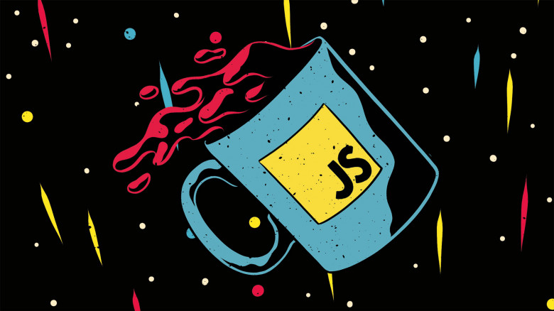

# Тема №4. Диалоговые окна в JavaScript 👄

Если ты используешь браузер как демо-среду, тогда нужно познакомиться с несколькими функциями его интерфейса, а именно: `alert`, `prompt` и `confirm`.

<div align="center">
  
</div>

## 🍋 alert

С этой функцией мы уже знакомы. Она показывает сообщение и ждёт, пока пользователь нажмёт кнопку "ОК".

Например:

```js
alert("Hi, MIREA!");
```

Это небольшое окно с сообщением называется **модальным окном**. Понятие **модальное** означает, что пользователь не может взаимодействовать с интерфейсом остальной части страницы, нажимать на другие кнопки и т.д. до тех пор, пока взаимодействует с окном. В данном случае - пока не будет нажата кнопка "OK".

## 🍍 prompt

Функция `prompt` принимает два аргумента:

```js 
result = prompt(title, [default]);
```

Этот код отобразит модальное окно с текстом, полем для ввода текста и кнопками `OK/Отмена`.

- `title`: Текст для отображения в окне.

- `default`: Необязательный второй параметр, который устанавливает начальное значение в поле для текста в окне.

> Квадратные скобки вокруг `default` в описанном выше синтаксисе означают, что параметр факультативный, необязательный.

Пользователь может напечатать что-либо в поле ввода и нажать OK. Введённый текст будет присвоен переменной `result`. Пользователь также может отменить ввод нажатием на кнопку "Отмена" или нажав на клавишу `key:Esc`. В этом случае значением `result` станет  `null`.

Вызов `prompt` возвращает текст, указанный в поле для ввода, или `null`, если ввод отменён пользователем.

Например:

```js
let age = prompt('Сколько тебе лет?', 25);

alert(`Тебе ${age} лет!`); // Тебе 25 лет!
```

> Второй параметр является необязательным, но если не указать его, то Internet Explorer вставит строку `"undefined"` в поле для ввода.

Запустите код в Internet Explorer и посмотрите на результат:

```js
let test = prompt("Test");
```

Чтобы `prompt` хорошо выглядел в IE, рекомендуется всегда указывать второй параметр:

```js run
let test = prompt("Test", ''); // <-- для IE
```

## 🌽 confirm

Синтаксис:

```js
result = confirm(question);
```

Функция `confirm` отображает модальное окно с текстом вопроса `question` и двумя кнопками: OK и Отмена.

Результат - `true`, если нажата кнопка OK. В других случаях - `false`.

Например:

```js
let isBoss = confirm("Ты здесь главный?");

alert( isBoss ); // true, если нажата OK
```

## 🍑 Итого

Мы рассмотрели 3 функции браузера для взаимодействия с пользователем:

- `alert`: показывает сообщение.

- `prompt`: показывает сообщение и запрашивает ввод текста от пользователя. Возвращает напечатанный в поле ввода текст или `null`, если была нажата кнопка "Отмена" или `key:Esc` с клавиатуры.

- `confirm`: показывает сообщение и ждёт, пока пользователь нажмёт OK или Отмена. Возвращает `true`, если нажата OK, и `false`, если нажата кнопка "Отмена" или `key:Esc` с клавиатуры.

> Все эти методы являются модальными: останавливают выполнение скриптов и не позволяют пользователю взаимодействовать с остальной частью страницы до тех пор, пока окно не будет закрыто.

На все указанные методы распространяются **два ограничения**:

1. Расположение окон определяется браузером. Обычно окна находятся в центре.
2. Визуальное отображение окон зависит от браузера, и мы не можем изменить их вид.

Такова цена простоты. Есть другие способы показать более приятные глазу окна с богатой функциональностью для взаимодействия с пользователем, но если "навороты" не имеют значения, то данные методы работают отлично! ⛱️