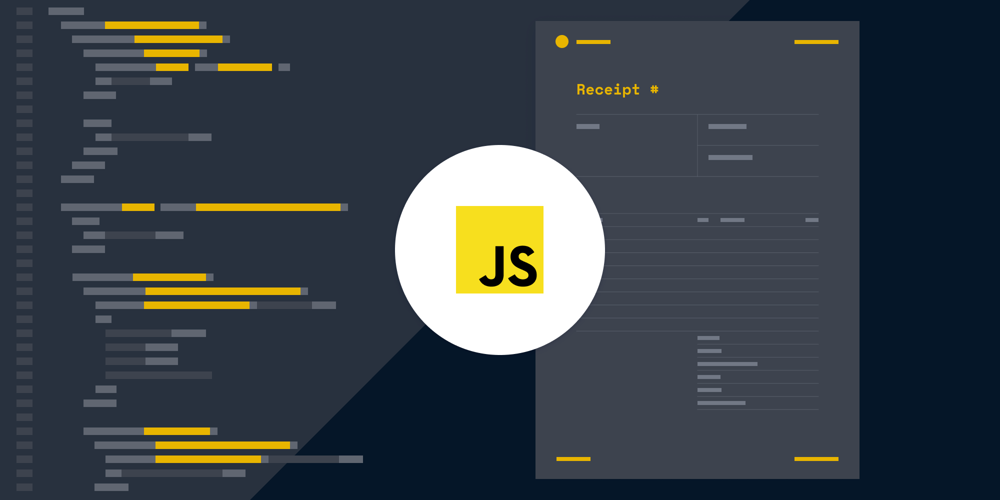

# Тема №8. Условное ветвление 🦋

Иногда нам нужно выполнить различные действия в зависимости от условий.

Для этого мы можем использовать инструкцию `if` и условный оператор `?`, который также называют оператором "вопросительный знак".

<div align="center">
  
</div>

## 🍓 Инструкция `if`

Инструкция `if(...)` вычисляет условие в скобках и, если результат `true`, то выполняет блок кода.

Например:

```js
let year = prompt('В каком году вышел мультфильм "Тачки"?', '');

if (year == 2006) alert( 'Ты прав!' );
```

В примере выше, условие - это простая проверка на равенство (`year == 2006`), но оно может быть и гораздо более сложным.

Если мы хотим выполнить более одной инструкции, то нужно заключить блок кода в фигурные скобки:

```js
if (year == 2006) {
  alert( "Правильно!" );
  alert( "Кчау!" );
}
```

Мы рекомендуем использовать фигурные скобки `{}` всегда, когда вы используете инструкцию `if`, даже если выполняется только одна команда. Это улучшает читаемость кода.

## 🍉 Преобразование к логическому типу

Инструкция `if (…)` вычисляет выражение в скобках и преобразует результат к логическому типу.

- Число `0`, пустая строка `""`, `null`, `undefined` и `NaN` становятся `false`. Из-за этого их называют "ложными" (`falsy`) значениями.
- Остальные значения становятся `true`, поэтому их называют "правдивыми" ("truthy").

Таким образом, код при таком условии никогда не выполнится:

```js
if (0) { // 0 is falsy
  ...
}
```

...а при таком - выполнится всегда:

```js
if (1) { // 1 is truthy
  ...
}
```

Мы также можем передать заранее вычисленное в переменной логическое значение в `if`, например так:

```js
let condition = (year == 2015); // преобразуется к true или false

if (condition) {
  ...
}
```

## 🍯 Блок "else"

Инструкция `if` может содержать необязательный блок `else` ("иначе"). Он выполняется, когда условие ложно.

Например:

```js
let year = prompt('В каком году была опубликована спецификация ECMAScript-2015?', '');

if (year == 2015) {
  alert( 'Да вы знаток!' );
} else {
  alert( 'А вот и неправильно!' ); // любое значение, кроме 2015
}
```

## 🍰 Несколько условий: `else if`

Иногда нужно проверить несколько вариантов условия. Для этого используется блок `else if`.

Например:

```js run
let year = prompt('В каком году вышел мультфильм "Тачки"?', '');

if (year < 2006) {
  alert( 'Это слишком рано...' );
} else if (year > 2006) {
  alert( 'Это поздновато' );
} else {
  alert( 'Верно!' );
}
```

В приведённом выше коде **JavaScript** сначала проверит `year < 2006`. Если это неверно, он переходит к следующему условию `year > 2006`. Если оно тоже ложно, тогда сработает последний `alert`.

Блоков `else if` может быть и больше. Присутствие блока `else` не является обязательным.

## 🗿 Условный оператор `?`

Иногда нам нужно определить переменную в зависимости от условия.

Например:

```js
let accessAllowed;
let age = prompt('Сколько вам лет?', '');

if (age > 18) {
  accessAllowed = true;
} else {
  accessAllowed = false;
}

alert(accessAllowed);
```

Так называемый "условный" оператор "вопросительный знак" позволяет нам сделать это более коротким и простым способом.

Оператор представлен знаком вопроса `?`. Его также называют "тернарный", так как этот оператор, единственный в своём роде, имеет три аргумента.

Синтаксис:

```js
let result = условие ? значение1 : значение2;
```

Сначала вычисляется `условие`: если оно истинно, тогда возвращается `значение1`, в противном случае -- `значение2`.

Например:

```js
let accessAllowed = (age > 18) ? true : false;
```

Технически, мы можем опустить круглые скобки вокруг `age > 18`. Оператор вопросительного знака имеет низкий приоритет, поэтому он выполняется после сравнения `>`.

Этот пример будет делать то же самое, что и предыдущий:

```js
// оператор сравнения "age > 18" выполняется первым в любом случае
// (нет необходимости заключать его в скобки)
let accessAllowed = age > 18 ? true : false;
```

> Но скобки делают код более простым для восприятия, поэтому мы рекомендуем их использовать.

В примере выше вы можете избежать использования оператора вопросительного знака `?`, т.к. сравнение само по себе уже возвращает `true/false`:

```js
// то же самое
let accessAllowed = age > 18;
```

## 💃🕺 Несколько операторов `?`

Последовательность операторов вопросительного знака `?` позволяет вернуть значение, которое зависит от более чем одного условия.

Например:

```js
let age = prompt('Возраст?', 18);

let message = (age < 16) ? 'Здравствуй, малыш!' :
  (age < 18) ? 'Привет!' :
  (age < 100) ? 'Здравствуйте!' :
  'Какой необычный возраст!';

alert( message );
```

Поначалу может быть сложно понять, что происходит. Но при ближайшем рассмотрении мы видим, что это обычная последовательная проверка:

1. Первый знак вопроса проверяет `age < 16`.
2. Если верно -- возвращает `'Здравствуй, малыш!'`. В противном случае, проверяет выражение после двоеточия ':', вычисляет `age < 18`.
3. Если это верно -- возвращает `'Привет!'`. В противном случае, проверяет выражение после следующего двоеточия ':', вычисляет `age < 100`.
4. Если это верно -- возвращает `'Здравствуйте!'`. В противном случае, возвращает выражение после последнего двоеточия -- `'Какой необычный возраст!'`.

Вот как это выглядит при использовании `if..else`:

```js
if (age < 3) {
  message = 'Здравствуй, малыш!';
} else if (age < 18) {
  message = 'Привет!';
} else if (age < 100) {
  message = 'Здравствуйте!';
} else {
  message = 'Какой необычный возраст!';
}
```

## 💅 Нетрадиционное использование `?`

Иногда оператор "вопросительный знак" `?` используется в качестве замены `if`:

```js run no-beautify
let company = prompt('Какая компания создала JavaScript?', '');

(company == 'Netscape') ?
   alert('Верно!') : alert('Неправильно.');
```

В зависимости от условия `company == 'Netscape'`, будет выполнена либо первая, либо вторая часть после `?`.

> Здесь мы не присваиваем результат переменной. Вместо этого мы выполняем различный код в зависимости от условия.

**Не рекомендуется использовать оператор вопросительного знака таким образом.**

Несмотря на то, что такая запись короче, чем эквивалентная инструкция `if`, она хуже читается.

Вот, для сравнения, тот же код, использующий `if`:

```js run
let company = prompt('Какая компания создала JavaScript?', '');

if (company == 'Netscape') {
  alert('Верно!');
} else {
  alert('Неправильно.');
}
```

При чтении глаза сканируют код по вертикали. Блоки кода, занимающие несколько строк, воспринимаются гораздо легче, чем длинный горизонтальный набор инструкций.

Смысл оператора "вопросительный знак" `?` - вернуть то или иное значение, в зависимости от условия. Пожалуйста, используйте его именно для этого. Когда вам нужно выполнить разные ветви кода - используйте `if`!

---

<div align="center"> Made with ❤️ by <b>dv0retsky</b> </div>