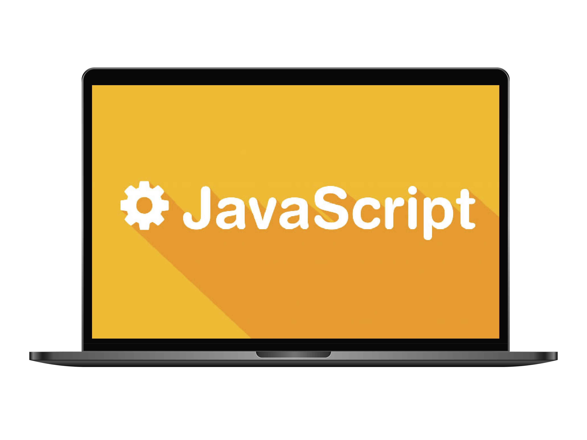

<h2 align="center">
  🐱 Программирование на JavaScript
</h2>

<div align="center">
  
</div>

# Оглавление курса | Фуллстек разработка
## Глава №1. Основы JavaScript

1. [**Введение в язык программирования JavaScript**](./JS1_Introduction/JS1_Introduction.md)
2. [**Переменные**](./JS2_Basic%20syntax/JS2_Basic%20syntax.md)
3. [**Типы данных**](./JS3_Data%20Types/JS3.%20Data%20Types.md)
4. [**Диалоговые окна**](./JS4_Dialog%20boxes/JS4_Dialog%20boxes.md)
5. [**Преобразование типов**](./JS5_Type%20Conversion/JS5_Type%20Conversion.md)
6. [**Базовые математические операции**](./JS6_Basic%20Mathematical%20Operations/JS6_Basic%20Mathematical%20Operations.md)
7. [**Операторы сравнения**](./JS7_Comparison%20Operators/JS7_Comparison%20Operators.md)
8. [**Условное ветвление**](./JS8_Conditional%20branching/JS8_Conditional%20branching.md)
9. [**Логические операторы**](./JS9_Logical%20operators/JS9_Logical%20operators.md)
10. [**Циклы**](./JS10_Cycles/JS10_Cycles.md)
11. [**Функции**](./JS11_Functions/JS11_Functions.md)
12. [**Массивы**](./JS12_Arrays/JS12_Arrays.md)
13. [**Методы массивов**](./JS13_Array%20Methods/JS13_Array%20Methods.md)
14. [**Map и Set**](./JS14_Map%20Set/JS14_Map%20Set.md)
15. [**Перебор свойств объекта**](./JS15_Enumerating%20object%20properties/JS15_Enumerating%20object%20properties.md)

## Глава №2. Браузер

1. [**Браузерное окружение**](./JS16_Browser%20environment/JS16_Browser%20environment.md)
2. [**DOM-дерево**](./JS17_DomTree/JS17_DomTree.md)
3. [**Навигация по DOM-элементам**](./JS18_Navigating%20DOM/JS18_Navigating%20DOM.md)
4. [**Поиск элементов**](./JS19_Search%20for%20elements/JS19_Search%20for%20elements.md)
5. [**Свойства узлов**](./JS20_Node%20properties/JS20_Node%20properties.md)
6. [**Атрибуты и свойства**](./JS21_Attributes%20and%20properties/JS21_Attributes%20and%20properties.md)
7. [**Изменение документа**](./JS22_Editing%20a%20Document/JS22_Editing%20a%20Document.md)
8. [**Стили и классы**](./JS23_Styles%20and%20classes/JS23_Styles%20and%20classes.md)
9. [**Прокрутка элементов**](./JS24_Scrolling%20elements/JS24_Scrolling%20elements.md)
10. [**Размеры и прокрутка окна**](./JS25_Window%20scrolling/JS25_Window%20scrolling.md)
11. [**Браузерные события**](./JS26_Browser%20events/JS26_Browser%20events.md)
12. [**Всплытие и погружение**](./JS27_Ascent%20and%20dive/JS27_Ascent%20and%20dive.md)
13. [**Делегирование событий**](./JS28_Event%20delegation/JS28_Event%20delegation.md)
14. [**Действия браузера**](./JS29_Browser%20Actions/JS29_Browser%20Actions.md)
15. [**Генерация событий**](./JS30_Event%20generation/JS30_Event%20generation.md)

## Глава №3. Продвинутый JavaScript


<br/>

<div align="center">

[](https://forthebadge.com) &nbsp;
[](https://forthebadge.com)

</div>

---

## 🚀 О проекте

Учебное пособие включает **теоретические сведения и практический материал**.  
Теоретическая часть дает общее представление о языке программирования **JavaScript**, его ключевых особенностях и сферах применения!

Этот курс предназначен для всех, от начинающих до тех, кто хочет углубить свои знания в системном и прикладном программировании.

---

## 🛠 Технологии и инструменты

- **JavaScript (ES6+)**  
- **Markdown** для теории и конспектов  
- **Node.js** (рекомендуется для запуска примеров)  
- Любой современный браузер (Chrome, Firefox, Edge, Safari)  

---

## ⚡ Быстрый старт

### 1️⃣ Клонируйте репозиторий

```bash
git clone https://github.com/dv0retsky/js-tutorial.git
```

### 2️⃣ Перейдите в папку проекта

```bash
cd js-tutorial
```

### 3️⃣ Изучайте теорию в Markdown файлах

### 4️⃣ Практикуйтесь с примерами кода

---

<div align="center"> Made with ❤️ by <b>dv0retsky</b> </div>